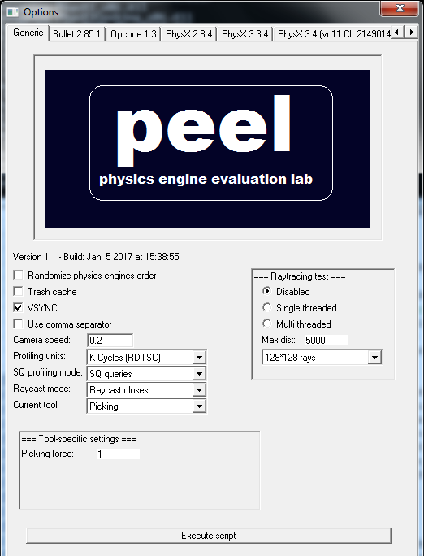

Pierre Terdiman -- v1.1 <pierre.terdiman@gmail.com>

# Introduction

Welcome to the Physics Engine Evaluation Lab - a.k.a. PEEL.

PEEL is a tool designed to evaluate, compare and benchmark physics
engines. In a way, it is very similar to the old PAL project (Physics
Abstraction Layer).

It was initially written to compare PhysX versions between each-other,
and catch performance regressions. Support for entirely different
engines was added later, giving the tool a much larger scope. To this
date it has been successfully used by various people to discover
previously unknown issues in their engines, and actually improve them.

# Physics engines selection

When you run PEEL, the first thing you see is the plugin selection
dialog:

{width="4.063193350831146in" height="3.125in"}

> Figure 1: plugin selection dialog

Each plugin is a DLL whose name starts with \"PINT\" (for Physics
INTerface). There is one plugin for each physics engine. To select a
plugin, click on it so that it is highlighted in blue, then click on the
\'Select\' button to validate your selection. You can choose as many
plugins as you want here. Otherwise if you are only interested in a
single plugin, you can simply double-click on its name directly.

Note: there is an internal limit of 32 plugins, and the Fx function keys
are used to enable/disable an engine. So it is best to select less than
12 engines at once.

# Main window -- Menu Mode

All selected plugins are loaded. If the loading is successful, PEEL\'s
main window should appear next. This is called the *Menu Mode*:

{width="6.547704505686789in"
height="6.7078116797900265in"}

> Figure 2: Main window, Menu Mode

The names of loaded plugins are listed at the top of the screen. In
Figure 2 for example, 4 different plugins have been loaded. The numbers
following the plugins' names are performance and memory stats for each
of them.

## Test selection

At the very bottom of the screen there is a list of available tests.
Each test has the following format:

Index: (category) -- name

*Index* is simply the test number. It has no purpose other than knowing
the total number of available tests.

*Category* is the group to which the test belongs.

> *Name* is the test's name.

Each test also has a description string, displayed in the brown window
located above the test selection area.

Use the arrow keys to navigate & select desired test. The Up and Down
arrow keys go to the previous or next test in the list. The Left and
Right arrow keys skip an entire category, which makes the navigation
quicker when you know what category you are interested in.

Once the desired test is selected (highlited in orange), press the
Return key to activate the test and switch the window to *Simulation
Mode*.

## Categories

Tests are roughly sorted into the following categories:

-   Undefined: tests that do not fall into one of the other categories.

-   API: tests that check the API works as expected. Usually very simple
    scenes doing only one specific thing (e.g. checking that collision
    filtering works)

-   Behavior: tests that check the physics behavior is as it should be,
    or at least plausible. Can be seen as correctness tests, as opposed
    to performance tests.

-   Contact generation: this category is dedicated to contact generation
    problems and pitfalls.

-   Joints: this category contains scenes that use traditional joints
    like spherical, hinge, prismatic, etc. These joints typically use
    the same iterative solver as the contacts.

-   Articulations: some physics engines support more advanced or more
    stable joints dedicated to articulated systems. They are usually
    more expensive than the regular joints, and may use dedicated
    solvers. This category is for them.

-   Performance: generic performance tests usually involving a lot of
    rigid bodies or complicated scenes.

-   Kinematics: tests that use kinematic objects.

-   Vehicles: tests that use dedicated, vehicle-specific modules.

-   Raycast: mainly performance tests for raycasts. Might include
    correctness tests as well.

-   Sweep: mainly performance tests for sweeps. Might include
    correctness tests as well.

-   Overlap: mainly performance tests for overlaps. Might include
    correctness tests as well.

-   CCD: tests dedicated to continuous collision detection problems.

-   Static scene: tests that only load a static scene, no rigid bodies.
    Mainly used for raytracing benchmarks.

-   WIP: work-in-progress tests.

Note that these categories are actually overlapping quite a bit, and
thus the sorting is only approximate. For example several tests in the
kinematics category are only concerned about the performance of
kinematics objects, and thus they would also fit in the performance
category.

# Main window -- Simulation Mode

In simulation mode, the selected test runs for all engines at the same
time, and the results are rendered on the same screen. Each engine has a
main color used both to display its name at the top of the screen, and
the rigid bodies it controls. Rendering all engines to the same screen
allows one to easily spot differences in behaviours between them. From a
performance point of view, it also emulates to a small extent how the
physics engine would be used in a real game, where other subsystems
would run before and after the physics simulation is performed.
Benchmarking the engines that way might provide more realistic results
than benchmarking them in isolation of everything else.

The top line contains the name of current test, and the number of
available camera positions. Most tests only have one camera position
available, but some of them (especially raytracing tests) have many. Use
the + and -- keys to change the camera position.

For each physics engine there are 4 performance numbers updated each
frame. The first number, just after the physics engine's name, is the
simulation time for current frame. *(Avg: x)* is the average simulation
time. *(Worst: x)* is the largest simulation time so far. The last
number is the memory used by each engine, provided the allocations have
all been properly re-routed to the engine's user-defined allocators.

*Frame: x* is a simple frame counter. It starts counting when entering
Simulation Mode, and stops counting when returning to Menu Mode. It is
possible to pause/resume the simulation by pressing P, and do frame-
by-frame simulation by pressing O (for "One frame").

*FPS: x* is a simple framerate counter. This is not terribly interesting
in itself, since it includes the accumulated simulation time of each
engine, as well as the rendering time. It is possible to disable
rendering entirely by pressing R. It is also possible to enable/disable
each physics engine by pressing the appropriate function keys. F1 maps
to the first listed engine, F2 to the second, etc. The framerate counter
might be capped to 60 Hz if VSync is enabled. It is possible to
enable/disable VSync in PEEL's Options Panel.

While a test is running, press Return to stop the simulation and return
to Menu Mode.

Press S to save an Excel file containing the current test's performance
data so far. PEEL currently does not display performance graphs on its
own, so it relies on Excel to create these.

Move the camera with the arrow keys and the mouse (using left-button
drag). Reset the camera position by pressing C. The camera position is
not automatically reset when running the same test twice. This allows
one to move the camera to an interesting spot, stop the simulation by
going to Menu Mode, and start the simulation again from the desired
point of view by starting the same test again. An alternative is

to pause the simulation in Menu Mode, start the simulation paused, move
the camera to the desired spot, then unpause.

In simulation mode, use the right mouse button to do an action. Select
desired action in the Options panel's generic tab, under "Current tool".
Default action is picking/manipulating rigid bodies. It is possible to
delete the currently picked/manipulated object by pressing the "Suppr"
key while the object is captured by the mouse.

{width="6.547704505686789in"
height="6.7078116797900265in"}

> Figure 3: Main window, Simulation Mode

# Per-test UI (configurable tests):

Since PEEL 1.1 each test can have its own UI panel, which appears when
the test is selected and simulation mode starts. These configurable
tests often gather together several of the PEEL 1.0 tests, which
explains why the total number of tests reported in Menu Mode is smaller
in PEEL 1.1 (even though it actually contains more tests overall than
the previous version).

Sometimes the settings used in the PEEL 1.0 scenes have been captured in
"preset" scenes, like for example in the ragdolls test scene:

{width="3.0191590113735782in"
height="1.7708333333333333in"}

Using the presets will recreate the same scenes as in PEEL 1.0.

Otherwise these dialogs are pretty much self-explanatory: tweak the
parameters as you wish, and press the "Reset test" button to restart the
test with the new settings. Alternatively, go back to the Menu Mode and
activate the same test again: the new settings will then be taken into
account. The settings are not reset until you start a different test.

# Options panel:

The options panel has one tab for shared/generic options, and one tab
for each loaded plugin.

{width="5.436805555555556in" height="7.125in"}

> Figure 4: Options Panel -- shared (generic) options

The generic tab contains settings affecting all engines:

## Randomize physics engines order

In Simulation Mode, all engines run sequentially. By default they run in
the order in which they are listed at the top of the screen, which
depends on the plugins' DLL names. There was a concern that the order
may have an impact on performance results, so this feature randomizes
the order each frame to make sure that benchmarks are not biased.

## Trash cache

The state of the cache has a large impact on performance. Running a
small scene in a single engine, in isolation from the actual game
engine, possibly without rendering, is a best case scenario that is
likely to produce unrealistic performance figures. The same scene in the
actual game will probably have lower performance. Running PEEL with
multiple physics engines at once and rendering enabled already takes
care of this issue to some extent. But this feature goes a bit further
and actually tries to flush the cache each frame, to emulate what might
happen in an actual game. This is rather experimental so far.

## VSYNC

This feature simply enables or disables VSYNC.

## Use comma separator

Defines which character is used as a separator in saved Excel files (','
or ';').

## Camera speed

In Simulation Mode it is possible to move the camera with the arrow
keys. This parameter defines the camera's speed when doing so.

## Profiling units

This feature defines the units of reported performance numbers.
Available options are:

-   K-Cycles (RDTSC): 1 reported unit = 1024 cycles, as measured by the
    RDTSC instruction.

-   ms (timeGetTime): 1 reported unit = 1 ms, as measured by the
    timeGetTime function.

-   us (QPC): 1 reported unit = 1 us, as measured by the
    QueryPerformanceCounter function.

## SQ profiling mode

SQ stands for Scene Queries, and an "SQ test" is one that focuses on
raycast, sweep or overlap queries. Physics engines often have two very
different codepaths here: one for managing the SQ structures (creating
them or updating them when rigid bodies move each frame), and one for
actually performing raycast, sweep or overlap queries against the
structure. Both of these codepaths are important and worth profiling.
This feature defines which part of the physics engines should be
profiled:

-   Simulation: profiles the structure's management
    (creation/update/etc), which usually happens during the rigid body
    simulation.

-   SQ queries: profiles the actual raycast, sweep and overlap queries.

-   Combined: profiles both and combines the results.

Note that this is also used for tests that add objects to the scene at
runtime. The "SQ queries" mode in that case would profile the cost of
the "add" calls. But this is only half of the story: sometimes the
actual work only happens during the next simulate call, and its cost
would be captured in the "Simulation" or "Combined" modes.

## Raycast mode

This feature defines what kind of raycast queries are used in the
"Raycast" test category:

-   Raycast closest: these are the regular raycasts returning a single
    hit (the closest one along the ray).

-   Raycast any: these are boolean raycasts simply returning whether the
    ray touched something or not. They should be faster than "raycast
    closest" queries.

-   Raycast all: these are raycasts returning all objects touched by the
    ray. They should be slower than "raycast closest" queries.

It would have been possible to create dedicated raycast tests for each
of these modes, but it would have potentially multiplied the total
number of raycast tests by 3 (to cover all cases). Instead, selecting
the mode as a global option reduces the total number of tests. On the
other hand it is slightly more tedious to use.

## Current tool & tool-specific settings

This feature defines what happens when pressing the right mouse button
(RMB) in Simulation Mode. Available tools are:

-   Picking: users can select and drag rigid bodies using the RMB.

-   Add impulse: pressing the RMB applies an impulse at the picked point
    on the picked object.

-   Shoot box: a new box is created, added to the scene, and shot in the
    view direction.

-   Camera tracking: selects the object that the camera will be
    tracking. After selecting an object here, you can for example go
    back to the picking tool and move that object around with the mouse.
    The camera will follow it.

Each tool can have additional settings in the "tool-specific settings"
area of the UI. For example the picking force for the picking tool can
be customized there. The contents of this area will change according to
selected tool.

## Raytracing test

This feature uses the physics engines' raycast queries to raytrace the
scene. The results are rendered in each plugin's dedicated tab, in the
"Raytraced view" window. Shading is very basic, since the goal is not to
create pretty pictures but to quickly visually check that everything is
working as expected. The raytracing test has a few options of its own:

-   Disabled: disables the raytracing test.

-   Single threaded: runs the test with a single thread.

-   Multi threaded: runs the test with 4 threads (each thread is given a
    quarter of the rendering window).

-   Max dist: ray length.

-   Number of rays: size of rendering window.

When the raytracing test is enabled, performance numbers are captured
for the whole operation and printed in the DOS console. Warning: this is
not the same as for the regular tests in PEEL, whose results are printed
on screen. For raytracing tests the units are currently K-cycles and
cannot be changed. The number of raycast hits is also reported to the
DOS console (Figure 5).

{width="6.544691601049869in"
height="3.2410411198600175in"}

> Figure 5: output of raytracing test

## Execute script

This feature allows one to run a set of tests automatically via a
script. A script is a simple text file with the following format and
supported commands:

> // Script name
>
> NbFrames 100 // Default number of frames to simulate Rendering false
> // Enable or disable rendering RandomizeOrder true // Randomize engine
> order each frame, or not
>
> TrashCache false // Trash cache after each simulation call, or not
>
> // Test \<name\> \<#frames\>
>
> Test SceneRaycastVsStaticMeshes_MeshSurface 1400 Test
> SceneRaycastVsStaticMeshes_TestZone_ShortRays
>
> ...

The script name and initial parameters should be obvious. The script
then runs each test sequentially for the given number of frames. An
Excel file containing performance data is automatically saved at the end
of each test. The number of frames to simulate can be customized for
each test, by writing the desired number after the test name (e.g.
"1400" in the above script). If that number is not specified, the
default number is used (e.g. "100" in the above script).

NOTE: there is currently an issue with configurable tests and scripts.
It is currently not possible to configure the tests from the script, so
the scripted tests will run using each test's default parameters. This
means that it is not possible anymore to run some of the PEEL 1.0 preset
scenes from a script.

## Per-engine options

Each physics engine can have its own options, captured in a separate tab
for each plugin/engine. These options are engine-specific and thus
beyond the scope of this document, but they typically map to something
exposed in the engine's API. Thus, please refer to each engine's
documentation for details.

Note that some options are activated immediately in the running test,
while others are only activated after the test is restarted. In doubt,
always restart the test after changing the options in the UI.

{width="5.333333333333333in" height="8.0in"}

> Figure 6: Options Panel -- per-engine options

## Scene stats

There is a special plugin named PINT_Stats.dll. This is not a physics
engine. This is a module gathering scene statistics, like the number of
created objects in a scene, and their type. PEEL itself does not gather
and display such stats, but this plugin does.

{width="5.332361111111111in" height="3.8125in"}

> Figure 7:

# Command line options

PEEL supports the following command line options:

-r Disable rendering

-p filename.dll Load given plug-in

-t test_name Select given test

// Disable all further command line arguments

This last one is handy if you want to temporarily ignore command line
arguments but still keep them around in Visual Studio\'s property page.
You can then have something like the following command arguments:

-r // -p PINT_Opcode20.dll -t SceneRaycastVsStaticMeshes_TessBunny16384

\...and only the first one will be taken into account.

# Typical PEEL usages

## Regression testing

PEEL can be used to catch performance or behavioral regressions from one
version to another.

For example when running several PhysX versions at the same time,
runtime performance for a new version should always be better or at
least equal to the one from the previous version. If it is not, then
either there is a known change that explains the regression (and the
regression might be acceptable), or it is a bug / unexpected side effect
that must be fixed.

Similarly, if for example the friction appears to be very different in
one version while the friction model did not change, it is probably a
bug that was not caught by unit tests or visual inspection.

There are a lot of subtle things that do not appear to be immediately
wrong when constantly working on the last version, but running the old
and new versions at the same time on the same screen makes a lot of
these things suddenly very obvious.

{width="6.5500951443569555in"
height="0.97875in"}

> Figure 8: PhysX performance going in the right direction in this scene

{width="5.013425196850394in"
height="3.013333333333333in"}

> Figure 9: Excel graph from PEEL's recorded data. This makes things
> even clearer.

## Benchmarking different options during development

PEEL can be used to benchmark different approaches while developping a
new feature.

For example you might have a define in your code that enables one
implementation or another, say e.g. SIMD vs non-SIMD. With PEEL it is
easy to compile a PINT plugin using one implementation, change the PINT
DLL's name, recompile with the other implementation, and run the two
competing versions against each other. Since they run at the same time,
they suffer from the same background noise at the same time, and the
resulting performance curves are usually quite clear with one version
always above the other. The winner is usually clearer with PEEL than
with more traditional benchmarks running competing implementations
sequentially.

{width="6.54765748031496in" height="1.485in"}

> Figure 10: different codepaths in Opcode 2.0. Which one is best?

## Raycast debugging

PEEL can be used to debug raytracing functions.

It is very easy to break a raytracing function without noticing. PEEL's
raytracing test can make subtle bugs visually obvious (unexpected black
pixels appearing here and there in the raytracing window, backface
culling or ray length not being properly respected, gaps appearing
between objects that should touch, etc). It is then possible to trigger
a breakpoint when e.g. a black pixel happens, and then just trace the
code.

{width="3.062508748906387in"
height="3.1041666666666665in"}

> Figure 11: unit tests pass, yet visually it's clearly broken.

## Benchmarking against the competition

PEEL can be used to benchmark engine A against engine B.

This is the purest way to do it, as comparing timings of two apps using
different physics engines but also different architectures, renderers,
or even different profiling functions is obviously dubious. PEEL uses
the same tests with the same input values going through the same
interface, with the same objects rendered the same way, profiled the
same way, on the same machine, with the same background noise at the
same time. This is the most objective way to compare engines. That being
said, there are a lot of pitfalls here, explained in Appendix A.

{width="6.556385608048994in"
height="0.8268744531933508in"}

{width="5.013425196850394in"
height="3.013333333333333in"}

> Figure 12: different engines running the same test at the same time.

Note the spike in figure 12. It happened because an unrelated program
started an expensive operation in the background. With PEEL, the
unexpected event affects all 3 engines, and thus the recorded
performance data remains fair and reliable. If we would run 3 tests
sequentially, each one with a different physics engine, the spike would
only happen during one of the tests, giving an unfair advantage to the
other two. Incidentally, the amplitude of the spike reveals that some
engines deal with external disturbances better than others.

## Write once, run everywhere

PEEL can be used as a complement to the PhysX samples and migration
guide from one version to the next. Or even from one engine to the
other.

If you missed the simple samples from PhysX 2.8, PEEL's simple tests can
be used as a replacement for the missing equivalent samples in PhysX
3.x. If the migration guide from PhysX 2.8 to PhysX 3.x is incomplete,
PEEL might be able to fill the gap if it uses the feature you are
interested in. If you are switching from engine A to engine B and you
knew how to do something in A, PEEL might be able to show you how to
replicate that thing in B.

{width="6.550945975503062in"
height="3.1471872265966754in"}

> Figure 13: the same limited hinge joint in different engines

# Keys summary

ESC Quit

Return Activate test (Menu Mode), End simulation (Simulation Mode) C
Reset camera

\+ Next camera pose

\- Previous camera pose

P Enable/disable pause

O Simulate one frame then pause

R Enable/disable rendering

H Show/hide help text

S Save Excel file containing performance data

W.  Enable/disable wireframe

X.  Enable/disable wireframe overlay

Suppr Delete picked object

Arrow keys Test selection (Menu Mode), camera motion (Simulation Mode)
or Vehicle control.

# Appendix A: physics benchmarks for dummies

Benchmarking on PC is a black art. Benchmarking physics engines is even
harder. Use the following notes to avoid the most basic mistakes.

## Use the proper power options.

> This is typically found in *Control Panel =\> System and security =\>
> Power Options*. Select the "High performance" power plan. Running
> benchmarks with the "Balanced" or "Power saver" plans produces
> unreliable results.

{width="6.573858267716536in"
height="3.143228346456693in"}

> Figure 14: power options

## Close all programs except PEEL. Unplug the internet.

Do not let programs like Outlook, Winamp, antivirus software, etc, run
in the background. They can start random tasks at random times that will
interfere with your benchmarks.

Ideally, start the Task Manager and kill all unnecessary processes.
There are so many here that listing them all is impossible, but with
some experience you should be able to know which ones can be killed, and
which ones are worth killing.

It is of course very tedious to do this each time. So ideally you would
take a radical step and use a dedicated PC with a fresh Windows
installation and no internet connection. That is exactly what I do, and
PEEL's benchmark results at home are a lot more stable than PEEL's
benchmark results at work. Even when I do unplug the internet cable on
the work PC...

For example Figure 15 shows the same scene captured at home and at work
in "the same" conditions (boot the PC, run PEEL, do the benchmark). We
see that the office PC is faster, but it also has a higher amount of
background noise. And that amount can become a lot larger, as seen in
Figure 12.

{width="5.018051181102362in"
height="3.013333333333333in"}

> Figure 15: stable vs noisy benchmarks

## Be aware of each engine's "empty" operating overhead.

In theory, when you run a physics update on an empty scene, all engines
should take the same amount of time, i.e no time at all since there is
nothing to do.

In practice, of course, this is not the case. PEEL's first test scene
measures this operating cost. Figure 16 shows various results expressed
in us.

{width="4.664536307961505in"
height="1.5208333333333333in"}

> Figure 16: operating overhead

## Avoid benchmarks with just one object.

As a consequence, avoid running benchmarks with just a few objects or
even a single object. The simulation time for just one object is likely
to be lower than the engine's empty operating overhead, because the main
internal algorithms are usually a lot more optimized than the glue code
that connects them all together. Thus, such benchmarks actually measure
this operating overhead more than anything else. While it is an
interesting thing to measure, it does not reflect the engines'
performance in real cases: the empty overhead is a constant time cost
which is going to be lost in the noise of an actual game.

Thus, for example, it would be very wrong to run a benchmark with a
single object and conclude that "engine A is faster than engine B" based
on such results.

## Try small scenes and large scenes.

Not all engines scale well. Some engines may be faster with small
scenes, but collapse completely with large scenes -- because large
scenes have a tendency to expose O(N\^2) parts of an engine.

Traditionally it is wise to "optimize for the worst case", so benchmarks
involving large scenes tend to have a higher weight than those involving
small scenes. Note that "small" and "large" are vague terms on purpose:
a large scene in a game today might be considered a small scene in a
game tomorrow. And at the end of the day, if it is fast enough for your
game, it does not matter that an engine does not scale beyond that. It
may matter for your next game though.

The point is: here again it is difficult to conclude from a limited set
of benchmarks that "engine A is faster than engine B". You may have to
refine your conclusions on a case-by-case basis.

## Be aware of sleeping.

Virtually all physics engines have "sleeping" algorithms in place to
disable work on non-moving, sleeping objects.

While the performance of an engine simulating sleeping objects is
important, it is usually not the thing benchmarks should focus on. In
the spirit of optimizing the worst case again, what matters more is the
engine's performance when all these objects wake up: they must do so
without killing the game's framerate.

Thus, PEEL typically disable sleeping algorithms entirely in its
benchmarks, in order to capture the engines' 'real' performance figures.
Unfortunately some physics engines may not let users disable these
sleeping mechanisms, and benchmarks can appear biased as a result --
giving an unfair advantage to the engines that put all objects to sleep.

Obviously, concluding that engine A (with sleeping objects) is faster
than engine B (with non-sleeping objects) is foolish. Keep your eyes
open for this in your experiments and benchmarks.

## Be aware of solver iteration counts.

Most physics engines have a fast iterative solver that uses a default
number of iterations. That default value may be different in each
engine. For fair comparisons, make sure compared engines use the same
number of iterations.

Alternatively, tweak the number of iterations in each engine until they
all use roughly the same amount of time, then check which one produces
the best simulation quality for the same CPU budget.

If a complex scene e.g. with joints does not work well by default in
engine A, but works well with engine B, think about increasing the
number of iterations for engine A. It might make it work while still
remaining cheaper overall than engine B. And so on.

Comparing how engines behave out-of-the-box, with their default values,
is only the tip of the iceberg.

## Artificial benchmarks are not an actual game.

What works in the lab does not always work in the field. A good result
in an artificial benchmark may not translate to a similarly good result
in the final game. Good results in artificial benchmarks are just hints
and good signs, not definitive conclusions. Take the results with the
proverbial grain of salt.

Benchmarks are often artificial because they capture situations that
would not actually happen in a game. At the same time, situations that
would actually happen in a game often aren't complicated enough to
expose significant differences between engine A and engine B, or they
are too complicated to recreate in a benchmark environment.

Similarly, physics usually only takes a fraction of the game's frame.
Thus, if engine A is "2X faster" than engine B in benchmarks, it does
not mean that using engine A will make your game 2X faster overall. If
your physics budget is 5% of the frame, even if you switch to an
incredible physics engine that takes absolutely no time, you still only
save 5% of the game's frame. Thus, it might actually be reasonable and
acceptable to switch to a *slower* engine if it offers other benefits
otherwise (better support, open source, etc).

## Benchmarks are never "done".

There is always some possible scenario that you missed. There is always
a case that you did not cover. There is maybe a different way to use the
engine that you did not think about. There is always the possibility
that an engine shining in all available benchmarks performs poorly in
some other cases that were not captured.

There are more than 300 tests in PEEL, and still it only scratches the
surface of what supported physics engines can do. Already though, in the
limited set of available tests, no single engine always ends up
"fastest". Sometimes engine A wins. Sometimes engine B wins.

# Appendix B: list of supported physics engines

At time of writing, PEEL has plugins for:

-   Bullet 2.79

-   Bullet 2.81

-   Bullet 2.82

-   Bullet 2.85.1

-   Newton 3.9

-   Newton 3.12

-   Newton 3.13

-   Newton 3.14

-   Havok 6.6.0

-   Havok 2011_3\_0

-   Havok 2011_3\_1

-   Havok 2012_1\_0

-   Havok 2012_2\_0

-   Havok 2013_1\_0

-   Havok 2014_1\_0

-   ICE Physics

-   NovodeX 2.1.1

-   Opcode 1.3

-   Opcode 2.0

-   PhysX 2.8.4

-   PhysX 3.1

-   PhysX 3.2

-   PhysX 3.3.0

-   PhysX 3.3.1

-   PhysX 3.3.2

-   PhysX 3.3.4

-   PhysX 3.4 (*many* versions)

-   GRB (GPU rigid bodies)

Writing and maintaining the PEEL plugins for each of these engines takes
a lot of time and effort. It goes without saying that it also requires a
good knowledge of each of these engines' API, which is something the
author does not necessarily have. Thus, these implementations are a
"best effort", and it is possible that some of them are suboptimal or
incomplete. A list of current known issues is maintained in a separate
text file in the PEEL distribution. The author strongly encourages
people familiar with the above APIs to look up the code, double-check
it, *and submit improvements or bugfixes*.

Note that PEEL can also be used to evaluate collision libraries like
Opcode, which are not "physics engines" per se, but they offer similar
collision detection features.

# Credits & thanks

PEEL and most of the PINT plugins were created by Pierre Terdiman. The
Newton plugin was written by Julio Jerez.

Thanks to Dirk Gregorius for his comments and feedback.
