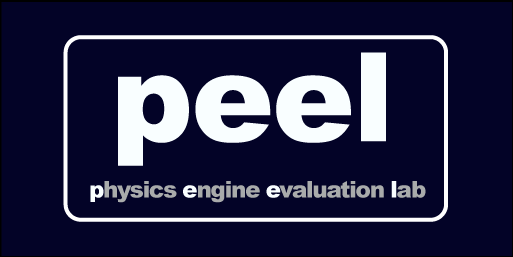

# Physics Engine Evaluation Lab (PEEL)

PEEL was designed to evaluate, compare and benchmark physics engines.

This is a branch of [PEEL v2.0 PhysX Edition](https://github.com/Pierre-Terdiman/PEEL_PhysX_Edition) that was originally focused on evaluating performance of NVIDIA PhysX. The original [PEEL v1.X](https://github.com/Pierre-Terdiman/PEEL) is a separate repository that included support for more physics engines.

The modifications by [Joel Van Eenwyk](https://github.com/joelvaneenwyk) in this repository are focused on making it easier to compile and run. Summary of changes:

1. [PhysX 4](https://github.com/NVIDIAGameWorks/PhysX) and [JoltPhysics](https://github.com/jrouwe/JoltPhysics) are both submodules that are compiled in as part of the main solution.
2. CMake support to PEEL and plugins.
3. Configuration settings for CLion (`.idea`) and VSCode (`.vscode`).
4. Added [CMake build GitHub action](https://github.com/physics-playground/PEEL/actions/workflows/build.yml).
5. Added [Sonar Cloud GitHub action](https://github.com/physics-playground/PEEL/actions/workflows/sonar-cloud.yml) to prevent regressions. See [Sonar Cloud - PEEL](https://sonarcloud.io/summary/overall?id=physics-playground_PEEL) for latest status.
6. Moved `PEEL` and `PEEL_Externals` sub-folders into root for less nesting.
7. Removed duplicate binaries (e.g., `glew32.dll`) and any binaries that we now build from source (e.g., those generated by PhysX). Note however that some of these binaries were custom-built so the version in this repository after building from source is expected to be different.

Windows is the only actively supported and tested platform. Development is primarily done with Visual Studio 2022 though other versions of Visual Studio are supported through CMake.

For information about how to use the tool itself see [PEEL User Manual](./Docs/PEEL%20User%20Manual.md). Some of the information is outdated, but it is still a useful reference.

## Setup

### Requirements

- Visual Studio 2022
- CMake v3.22+

### Steps

1. Clone [PEEL](https://github.com/physics-playground/peel) and include submodules.
2. Run `build.bat` in root to generate project files and build for VS2022.

Generated solution is available under `Build/x64_vs2022/PEEL.sln`

## Screenshots

### Dominoes

### CylinderStack

### ThreeLegoGears

### SphericalJointNet

### PortalScene2

### ArticulatedChain_MCArticulation

### LegoExploding

### ConvexGalore3

### VoronoiFracture2

### VoronoiFracture5

### LegoSpeedChampions_DodgeChallenger

### LegoPolicePursuitTruck

### SceneConvexSweepVsStaticMeshes_TessBunny

### LegoStaticMesh (1)

### LegoStaticMesh (2)

### SceneRaycastVsStaticMeshes_TessBunnyShort

### StaticMesh

### CaterpillarTrack

### BulldozerTest

### ConvexCompoundChain

### OverlapObjects_DynamicSpheres

